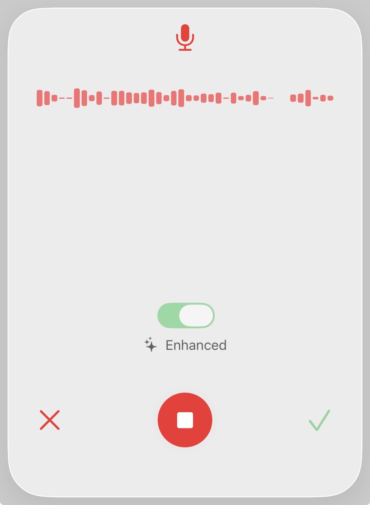

# VoiceInput

SwiftUI voice input component with real-time waveform visualization.

Supports on-device transcription via Apple's Speech framework and cloud-based transcription through a protocol-based architecture. Includes built-in Mistral AI integration with the ability to implement custom transcribers.



## Features

- Dual transcription modes: on-device (SFSpeechRecognizer) and cloud LLM
- Real-time audio waveform visualization
- Protocol-based architecture for custom transcriber integrations
- Built-in Mistral AI integration
- No external dependencies

## Requirements

- iOS 17.0+
- Swift 6.0

## Installation

### Swift Package Manager

Add the package dependency:

In Xcode, go to **File > Add Package Dependencies** and enter:
```
https://github.com/vitalydolgov/VoiceInput
```

Or add to your `Package.swift`:
```swift
dependencies: [
    .package(url: "https://github.com/vitalydolgov/VoiceInput.git", branch: "main")
],
targets: [
    .target(
        name: "YourTarget",
        dependencies: ["VoiceInput"]
    )
]
```

### Permissions

Add to your `Info.plist`:

```xml
<key>NSMicrophoneUsageDescription</key>
<string>We need microphone access to record your voice input</string>
<key>NSSpeechRecognitionUsageDescription</key>
<string>We need speech recognition to transcribe your voice input</string>
```

## Usage

### Basic

On-device transcription using Apple's Speech framework:

```swift
import SwiftUI
import VoiceInput

struct ContentView: View {
    @State private var showVoiceInput = false
    @State private var transcribedText = ""

    var body: some View {
        VStack {
            Button("Start Voice Input") {
                showVoiceInput = true
            }

            Text(transcribedText)
        }
        .sheet(isPresented: $showVoiceInput) {
            VoiceInputView(
                onConfirm: { text in
                    transcribedText = text
                    showVoiceInput = false
                },
                onCancel: {
                    showVoiceInput = false
                }
            )
        }
    }
}
```

### With Mistral AI Transcription

Cloud-based transcription with toggle to switch between on-device and LLM:

```swift
VoiceInputView(
    onConfirm: { text in
        transcribedText = text
        showVoiceInput = false
    },
    onCancel: {
        showVoiceInput = false
    },
    llmTranscriber: MistralTranscriber(apiKey: "your-mistral-api-key")
)
```

## API

Public types available for use:

- **`VoiceInputView`** - Main view component
- **`Transcriber`** - Protocol for custom transcription services
- **`MistralTranscriber`** - Mistral AI transcription

## Custom Transcriber

Implement the `Transcriber` protocol to integrate any transcription service:

```swift
struct MyTranscriber: Transcriber {
    let apiKey: String

    func transcribe(file: URL, language: String?) async throws -> String {
        let audioData = try Data(contentsOf: file)

        // Send audioData to your transcription API
        // Return transcribed text

        return transcribedText
    }
}
```

## License

MIT
